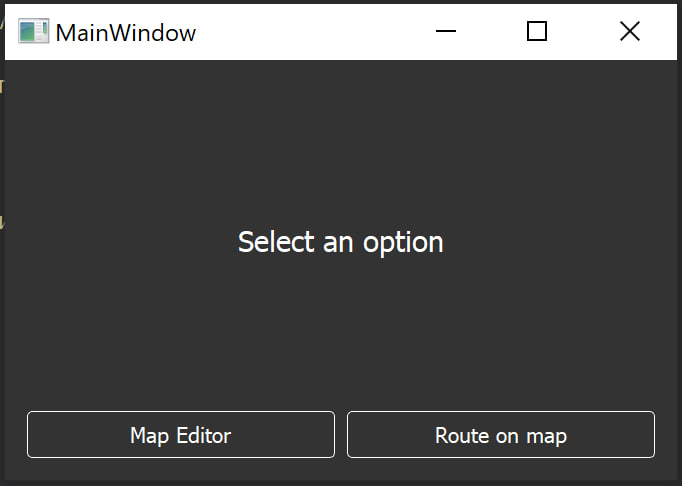
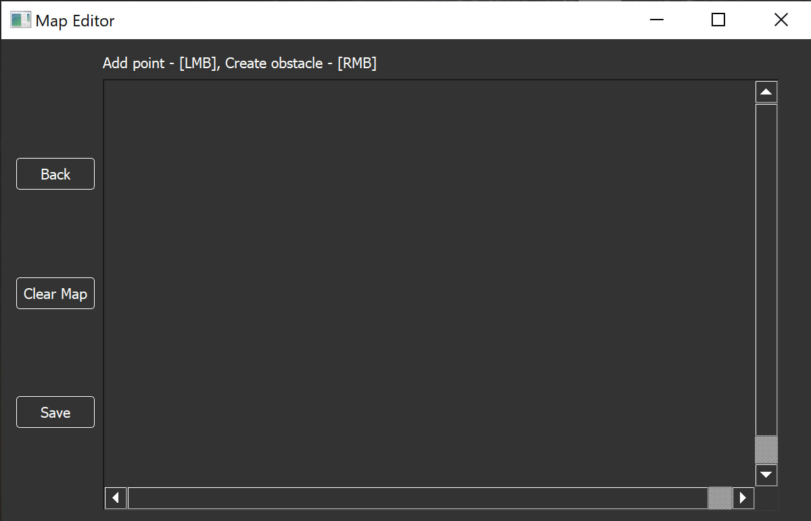
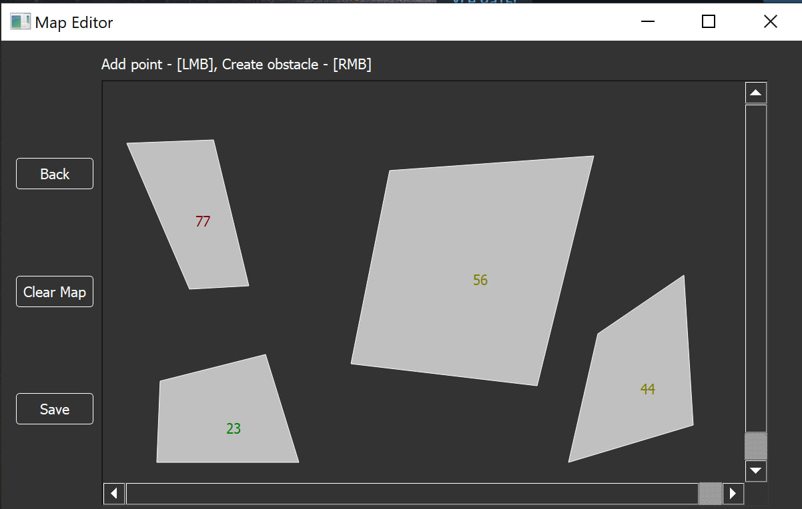
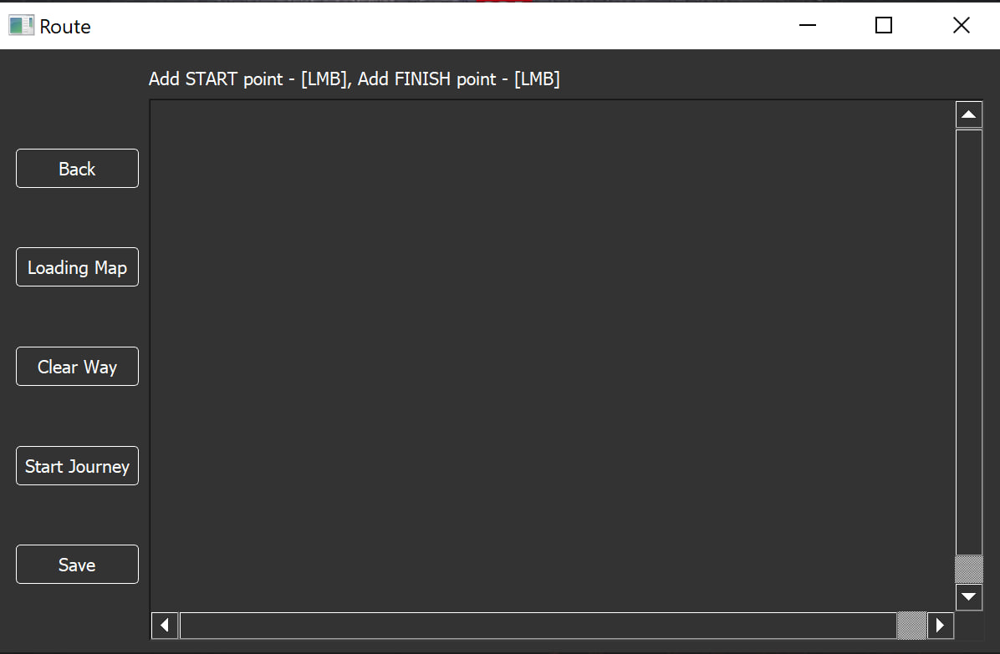
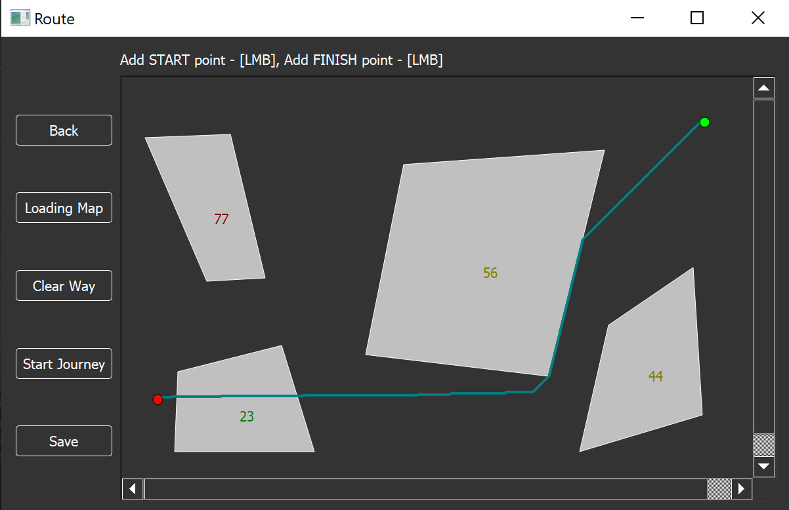

<p align = "center">
  
  
</p>

# Route-Map

Route-Map is an application for route planning on a map using the A* (A-star) algorithm. The application allows setting starting and ending points on the map, then finding the optimal route between them while avoiding obstacles.

## Usage

1. Download the archive from the "Releases" section.

2. Extract the archive and run the ```.exe``` file.

   
   
3. Go to the "Map Editor" section.

   

4. Create a map and save it(.xml file).

   

5. Go back to the main menu and navigate to the "Route on Map" section.

   

6. Load the map and set the starting and ending points on the map.

7. Click the "Start Journey" button to build the route.

   

8. The route will be displayed on the map as a line. The starting point will be marked with a green circle, and the ending point with a red circle.

## Documentation

* Reports can be found in the ```reports``` folder.
* Doxygen style [documentation](https://woofiwaffle.github.io/Route-Map/)

## Requirements

* Windows 10
* QtCreator

## Building the Project

To build the project, you'll need a development environment like Qt Creator and the necessary libraries. Follow these steps:

1. Download the source code from the repository.
2. Open the project in Qt Creator.
3. Build the project.

## License

The project is distributed under the Apache License Version 2.0. See the ```LICENSE``` file for details.

## Contribution

We welcome contributions to the project! Before contributing, please make sure to review our [Code of Conduct](CODE_OF_CONDUCT.md) and [Contribution Guidelines](CONTRIBUTING.md). 

Please create a pull request or open an issue to discuss changes.
